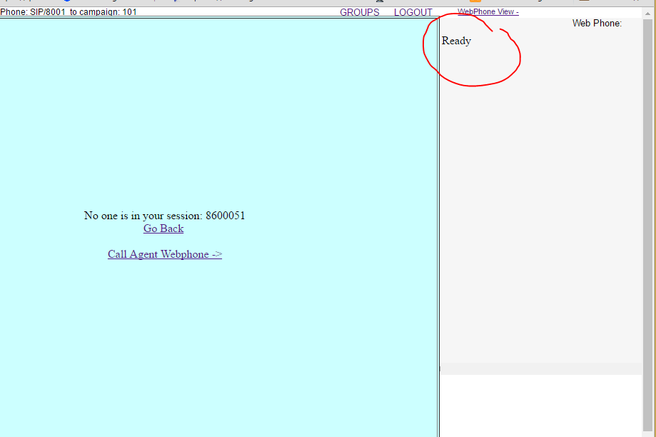

# PBXWebPhone
WebRTC based webphone for Vicidial.
Testet with ViciBox: 7.0.3 | VERSION: 2.12-558a | BUILD: 160602-1450 

## Getting Started
It is required that your Vicidial installation supports secure connection.

- Clone this project into agc directory (if you are using vicibox /srv/www/htdocs/agc/)
- In vicidial ADMINISTRATION page change Admin->System Settings->Webphone URL: to
  PBXWebPhone/index.php
- Enable webphone in phone config 
   * Admin->Phones->\<Phone exten\> change "Set As Webphone" to "Y"
- Specify Web Socket URL:
  * Admin->Servers->\<Dialler server\>-> Web Socket URL: to "wss://\<server domain name\>:8089/ws"
- Configure asterisk ([Asterisk configuration example](https://github.com/chornyitaras/PBXWebPhone/wiki/Asterisk-configuration))  

Check out [Wiki](https://github.com/chornyitaras/PBXWebPhone/wiki) for more information.

# Screenshot
You should see something like this if everything configured correctly:

**PS:**  I advise to use [letsencrypt](https://letsencrypt.org/) for getting **free** ssl certificates

**PPS:**
Any comments and suggestions are welcomed. Feel free to post issue or pull request
